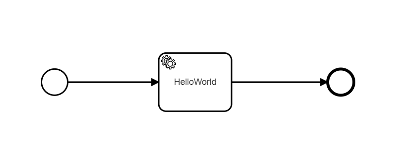
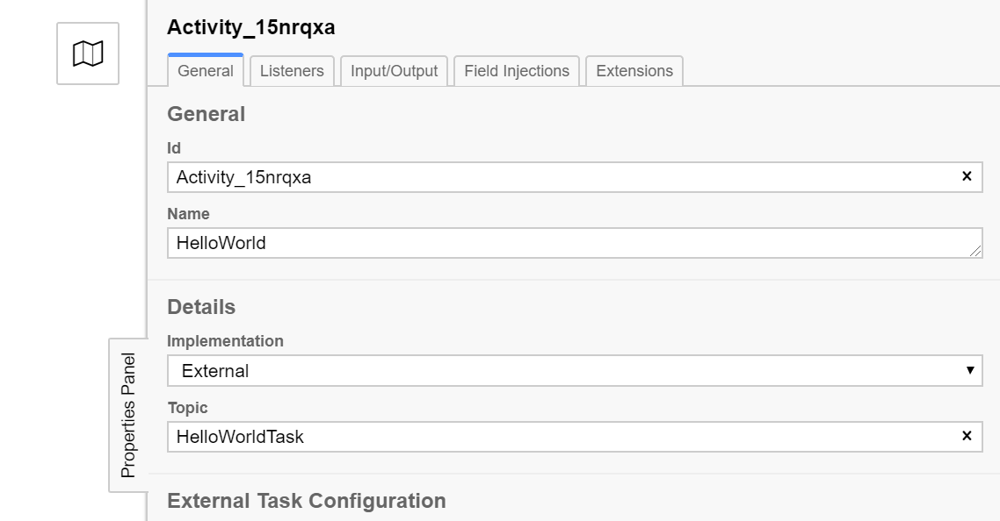
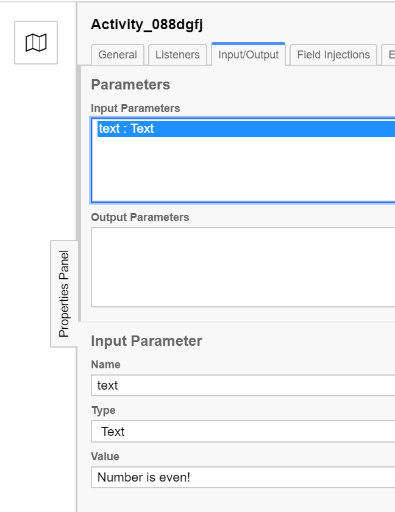
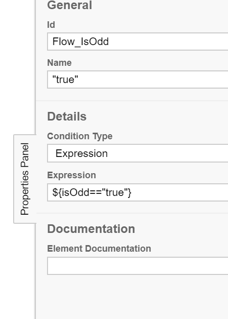

# camunda-external-task-client-python3

!! This is a fork of . It is not compatible with the original code base any longer.!!

This fork makes use of `async/await` and operates workers asynchronously rather than threaded. Additionally, it contains some convenience functions that wrap the Camunda REST API and speed up development.

## Installation

The easiest way to install this client is via `pip`:

```bash
pip install git+https://github.com/OpenAvikom/camunda-external-task-client-python3
```

If you want to run the examples, it might be easier to first clone the project and run everything locally:

```bash
git clone https://github.com/OpenAvikom/camunda-external-task-client-python3.git
cd camunda-external-task-client-python3
pip install -e .   # install module editable 
```

## Hello World Example

This example will show you how to let a Python client communicate with Camunda.

Firs, we assume that Camunda is up and running. If that's not the case, you might want to have a look at the [Camunda Platform Docker Images](https://github.com/camunda/docker-camunda-bpm-platform).
Second, we assume that Camunda is running at [localhost:8080](localhost:8080). If not, you need to adapt the example below accordingly.
Third, you need a way to deploy and run BPMN-Prozesses. The [Camunda Modeler](https://camunda.com/de/download/modeler/) is probably a good point of departure.

### The Model

The file [`bpmn_process/hello_world.bpmn`](bpmn_process/hello_world.bpmn) contains a very simple model:




We have a start event (left circle), a ServiceTask to conduct and an end event (right circle). When you hit the 'Start Current Diagram' (the 'play' button in the modeler) nothing much will happen.
The process will be running though. You can check [localhost:8080](localhost:8080) to make sure.

Not let's have a closer look at the 'Hello World' external task (the square symbol with the cogs at the top right).
The interesting fields in the property panel are `Implementation` and `Topic`:



`Implementation` tells Camunda, that the task should be resolved by an `External` worker and `Topic` is a string that more or less describes the task to be conducted.
We see that Camunda is now waiting for an external worker that is capable of conducting a task with the topic `HelloWorldTask`.
The Camunda Cockpit will show you a running process waiting for `HelloWorld` to be completed by an external process.
Now let's create a Python client which will subscribe to that topic and do tasks by just returning a success event.
The file can be found in [`examples/hello_world.py`](examples/hello_world.py):

```python

import aiohttp
import asyncio

from camunda.external_task.external_task import ExternalTask, TaskResult
from camunda.external_task.external_task_worker import ExternalTaskWorker


async def main():
    # let's create an async http context with aiohttp
    # aiohttp will close the connection when the worker returns (it won't though)
    async with aiohttp.ClientSession() as session:
        # We create a worker with a task id and pass the http session as well as the REST endpoint of Camunda.
        # You need to change 'base_url' in case your Camunda engine is configured differently.
        worker = ExternalTaskWorker(worker_id=1, base_url="http://localhost:8080/engine-rest", session=session)
        print("waiting for a task ...")
        # Subscribe is an async function which will block until the worker is cancelled with `worker.cancel()`,
        # In this example, no one will do this. We will stop the program with Ctrl+C instead
        # When the worker detects a new task for the topic assigned to `topic_name` it will trigger the 
        # function/method passed to `action`.
        await worker.subscribe(topic_names="HelloWorldTask", action=process)

# this will be called when a task for the subscribed topic is available
async def process(task: ExternalTask) -> TaskResult:
    print("I got a task!")
    # Right now we just return the result of `task.complete` which is a 
    # `TaskResult` that messages Camunda a successful task execution.
    # If we return `task.failure()` instead, Camunda will publish the task again until
    # some client finally completes it or the maximum amount of retries is reached.
    return task.complete()

# run the main task
asyncio.run(main())
```

You can run that example from the project folder with:

```bash
python examples/hello_world.py
```

You should see something like this in your terminal:

```
python ./examples/hello_world.py
waiting for a task ...
I got a task!
```

If you don't see the second line you probably need to start the Camunda process (in the modeler).


## Working with data

The example above is quite trivial since our client just returns a success event/result but nothing actually happens.
In the next example, we will let the python worker decide whether a passed number is odd or even.
First, let's have a look at the BPMN [bpmn_process/odd_number.bpmn](bpmn_process/odd_number.bpmn):


We have to external `ServiceTasks` labeled `Number is even!` and `Number is odd!`.
Both use the same topic `EchoTask` which we will use to print text to the terminal.
Have a look in the property panel and click the `Input/Output` tab of one of the tasks.
You should see something like this:



The task defines one input parameter named `text` of type `Text` with a value of `Number is even!` (or odd).
Next, let's have a look at `Number Check`:

```XML
<bpmn:serviceTask id="Activity_NumberCheck" name="Number Check" camunda:type="external" camunda:topic="NumberCheckTask">
    <bpmn:extensionElements>
    <camunda:inputOutput>
        <camunda:inputParameter name="number">42</camunda:inputParameter>
        <camunda:outputParameter name="isOdd">${result}</camunda:outputParameter>
    </camunda:inputOutput>
    </bpmn:extensionElements>
    <bpmn:incoming>Flow_Start</bpmn:incoming>
    <bpmn:outgoing>Flow_OutCome</bpmn:outgoing>
</bpmn:serviceTask>
```

Now you might say 'Wait! Where does this come from?'.
You can use the Modeler GUI to edit values but you can also edit the BPMN-XML direclty.
In the lower left you will see two tabs labelled `Diagram` and `XML`. This is where you change the view.

We see that the topic `camunda:topic` has been set to `NumberCheckTask` and that the service task contains two parameters in the `camunda:inputOutput` block.
We assign `42` to `number` and assign the received out parameter `result` to the environment variable `isOdd`.
Of course, you can change the value of `number` as you like. 
You also don't need to do it in the XML view.
Just change back to `Diagram` and look for the `Input/Output` tab in the property panel of `Number Check`.

Last, we have a look at the Gateway (the diamond-shaped box with the big X).
The gateway itsel just has a label. 
This does nothing but can be used to clarify what the gateway will evaluate.
We will evaluate our previously assigned `isOdd` variable.
To do so, we need to set conditions on the flows leaving the gatway.
If you click on the flow to the bottom (labeled with `"true"`), the property panel will look like this:



The `name` parameter is again just something that makes your model easier to comprehend.
The `Condition Type` and `Expression` will determin if a Flow is considered valid.
We chose `Expression` since we want to check the value of `isOdd`.
In Camunda, this is done as seen in the picture above.
When `isOdd == "true"` the service task `Number is odd!` will be executed and the process will end after this.
The flow above the gateway has a line crossing the flow which means that this is the default flow when no other condition is met.
So, what we do is we check whether `isOdd` is equal to `"true"`, execute `Number is odd!` if that is the case or `Number is even!` otherwise.

Now let's see how [examples/odd_number.py](examples/odd_number.py) looks like:

```python
import aiohttp
import asyncio

from camunda.external_task.external_task import ExternalTask, TaskResult, Variables
from camunda.external_task.external_task_worker import ExternalTaskWorker

async def main():
    async with aiohttp.ClientSession() as session:
        # a new parameter! We can pass 'asyncResponseTimeout' to Camunda to configure how long a 'fetch and lock' connection
        # is kept alive. If this value is rather large, clients do not need to reconnect that often but it will take longer for a
        # worker to properly shut down. The default value is 30 seconds (300000)
        worker = ExternalTaskWorker(
            worker_id=4,
            base_url="http://localhost:8080/engine-rest", session=session,
            config={"asyncResponseTimeout": 5000}  # wait 5 seconds before timeout
            )
        # Our worker will now subscribe to two topics now
        # We will create a new task with `asyncio.create_task` and await only the second subscribe
        asyncio.create_task(worker.subscribe(topic_names="NumberCheckTask", action=number_check))
        await worker.subscribe(topic_names="EchoTask", action=echo)

async def number_check(task: ExternalTask) -> TaskResult:
    try:
        number = task.get_variable("number")
        print(f"We received {number} for checking...")
        # we create a Variables object to hand to the TaskResult
        variables = Variables()
        # we set the variable 'result' to 'true' or 'false'
        variables.set_variable("result", "true" if int(number) % 2 != 0 else "false", Variables.ValueType.STRING)
        # We pass the variables object as LOCAL variables which will only be available in the context of the task
        # that called the external task worker. The result must be assigned in case it should be used somewhere else.
        # Just have a look at the odd_number.bpmn to see how.
        return task.complete(local_variables=variables)
    # If your input could not be parsed with `int()` the task will fail
    # and another external service could try to do better.
    except Exception as err:
        print(f"Oh no! Something went wrong: {err}")
        return task.failure()


async def echo(task: ExternalTask) -> TaskResult:
    print(f"Camunda wants to say: {task.get_variable('text')}")
    return task.complete()

# run the main task
asyncio.run(main())
```

We now have two callbacks and our worker will subscribe them the appropriate topic as seen in the BPMN model.
We also reduce the `asyncResponseTimeout` of the worker to prevent already closed python clients to accidently fetch tasks.
This is just a workaround for the sake of simplicity.
It is recommended to actually wait for worker subscriptions to return before shutting down the whole process.

In `number_check` and in `echo`, we see how to retrieve variables from the `ExternalTask` object `task`.
In `number_check`, there is also shown how a `Variables` object is created, a value is assigned and how this object is passed as a **local** variables object.
Local variables can only be used in the scope of the service task.
This is why we have to assign `result` to an output parameter in Camunda.
We could also pass `variables` to `global_variables` instead.
This way, `result` could be used in the whole process.
However, in more complex scenarios this might clutter the environment and may even lead to colliding variable definitions.
Keeping things local increases the control by keeping variable scopes narrow and also *visible* in the BPMN model.

When you run the example, you should see an output like this after you have started the Camunda process:

```
python ./examples/odd_number.py
We received 42 for checking...
Camunda wants to say: Number is even!
```
